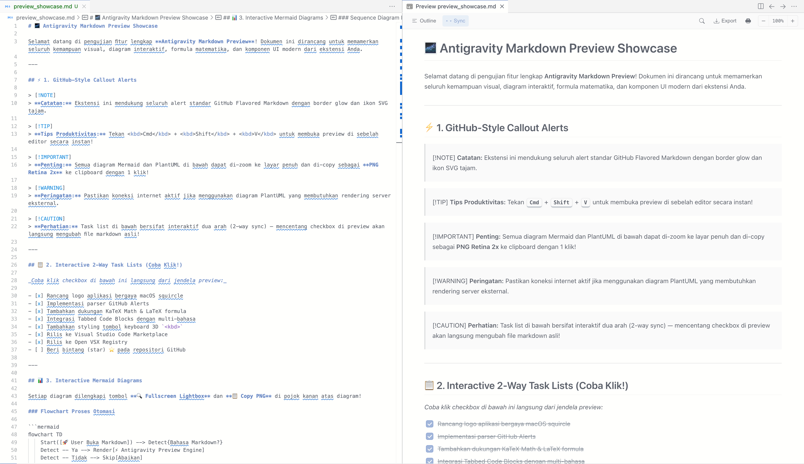
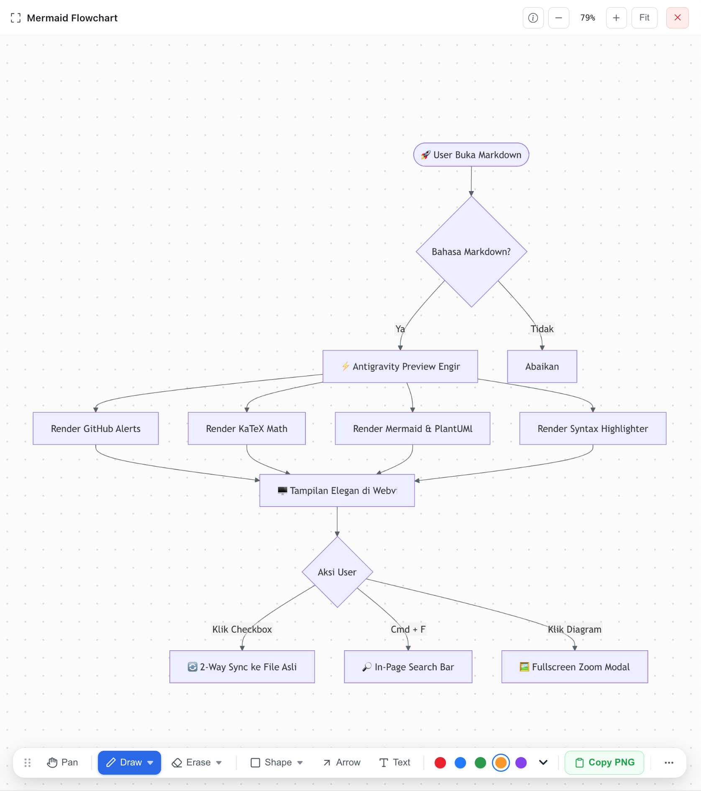
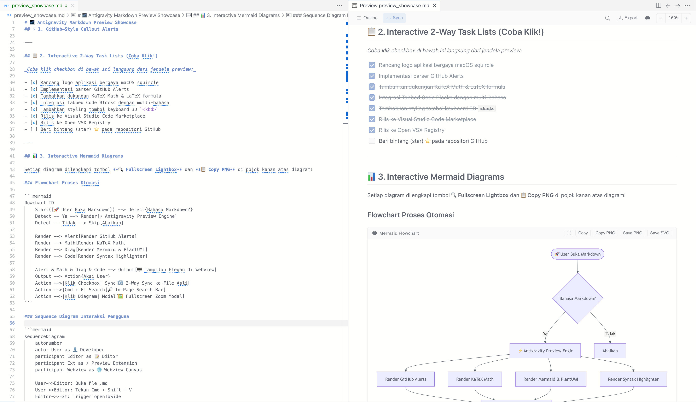
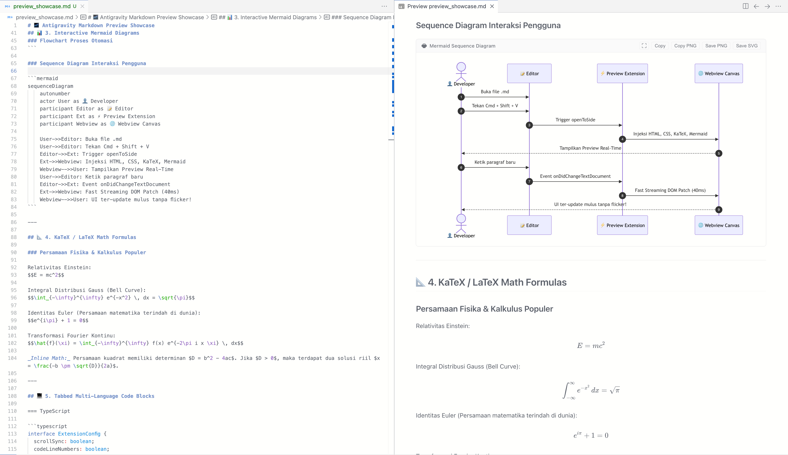
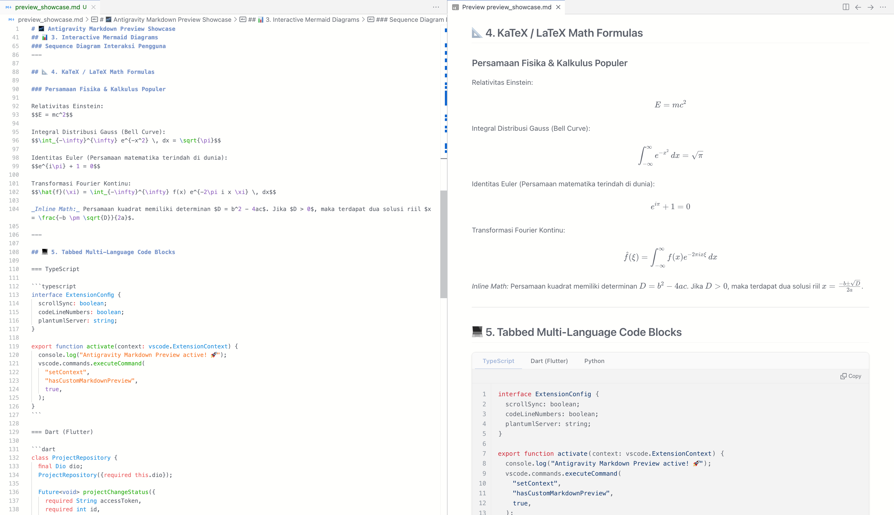
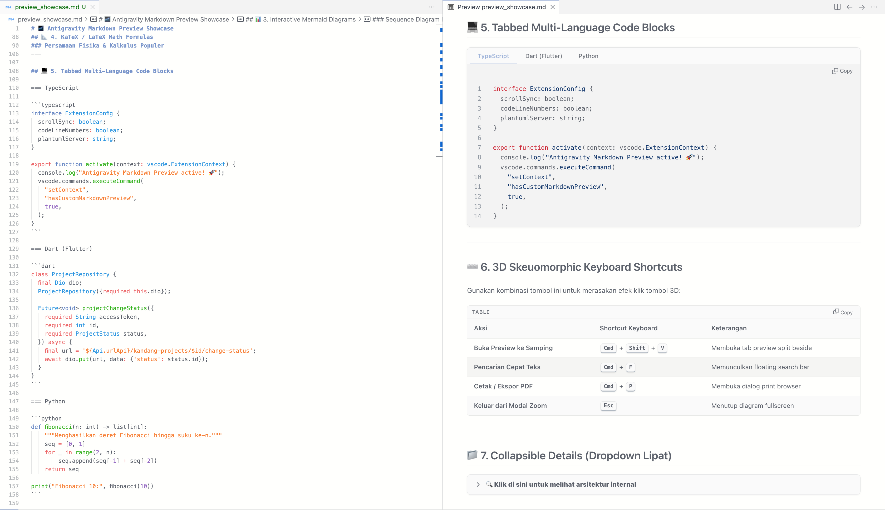

<div align="center">
  
  <h1>Antigravity Markdown Preview</h1>
  <p>The definitive, desktop-grade Markdown preview engine for <b>Antigravity IDE</b> and <b>VS Code</b>.</p>

  <p>
    <a href="https://marketplace.visualstudio.com/items?itemName=Affandilham.antigravity-markdown-preview"></a>
    <a href="https://open-vsx.org/extension/Affandilham/antigravity-markdown-preview"></a>
    <a href="LICENSE"></a>
  </p>

  <br />
  
</div>

---

## 🌟 Overview

**Antigravity Markdown Preview** transforms your editor's Markdown experience into a publishing-grade canvas. Designed with meticulous attention to detail, it bridges the gap between raw documentation and presentation-ready content — featuring **interactive two-way task lists**, client-side **Mermaid & PlantUML diagrams**, **KaTeX mathematical typesetting**, **tabbed multi-language code fences**, and a **desktop pro-grade fullscreen lightbox** with live drawing annotations and partial erasing.

---

## ✨ Key Features & Visual Showcase

### 1. 🖼️ Fullscreen Diagram Lightbox & Annotation Studio

Click any diagram (or hover and press the **🔍 Fullscreen Lightbox** button) to open an expansive canvas with an elegant floating annotation dock.

<p align="center">
  
</p>

- **Smooth Zoom & Pan**: Fluid navigation via Pinch-to-zoom, mouse wheel, double-click fit, or dedicated zoom control buttons.
- **Freehand Draw with Opacity Control**: Draw strokes with customizable stroke width (1–50px), opacity/transparency (5–100%), and a 15-color palette plus custom HSV color picker.
- **Segment-Level Partial Eraser**: Precision eraser with adjustable radius (4–100px) that slices only intersecting stroke segments instead of deleting entire objects.
- **Geometric Shapes & Arrows**: Rectangle, Circle, Ellipse, Line, Rounded Rect, and Arrows with live interactive sizing.
- **In-Canvas Floating Text**: Spawn and edit text directly on top of diagrams with customizable font size (8–72px) and styling (Bold, Italic, Underline).
- **Responsive Auto-Collapsing Dock**: Gracefully adapts to narrow viewports by collapsing overflow actions into a clean **More (`...`)** menu without clipping or horizontal scrollbars.
- **1-Click Copy PNG & History**: Export high-resolution Retina 2x annotated PNGs directly to your clipboard, backed by full multi-level Undo/Redo (<kbd>Cmd</kbd>+<kbd>Z</kbd> / <kbd>Cmd</kbd>+<kbd>Shift</kbd>+<kbd>Z</kbd>).

---

### 2. 📋 Interactive Two-Way Task Lists

Task lists are fully interactive directly inside the preview panel. Toggling a checkbox in the preview automatically updates the corresponding `- [ ]` or `- [x]` markdown source in real time without reloading the webview.

<p align="center">
  
</p>

---

### 3. 📊 Native Mermaid & PlantUML Diagrams

Render complex software architecture, sequence workflows, state machines, and class structures with crystal-clear vector graphics.

<p align="center">
  
</p>

- **Mermaid 11.x Support**: Flowcharts, Sequence diagrams, Class diagrams, State diagrams, Entity Relationship diagrams (ERD), User Journey, Gantt charts, Git graphs, and Mindmaps.
- **PlantUML Integration**: Zero-setup PlantUML rendering powered by deflate compression and Kroki.
- **Hover Action Bar**: Every diagram includes quick-action buttons for **Copy SVG**, **Copy PNG (Retina 2x)**, **Save SVG**, **Save PNG**, and **Fullscreen Lightbox**.

---

### 4. 📐 KaTeX Mathematical Typesetting

Render complex scientific formulas, calculus, physics equations, and linear algebra in real time.

<p align="center">
  
</p>

- **Inline Equations**: `$E = mc^2$`
- **Display Block Equations**: `$$\\int_{-\\infty}^{\\infty} e^{-x^2} dx = \\sqrt{\\pi}$$`
- **Currency Protection**: Intelligent currency escaping prevents legitimate prices (e.g. `$10 - $20`) from being erroneously parsed as math formulas.

---

### 5. 💻 Tabbed Multi-Language Code Blocks

Organize multi-language implementations cleanly using clean tab headers.

<p align="center">
  
</p>

- **Tabbed Fences**: Group snippets across TypeScript, Dart, Python, Go, Rust, and more.
- **Syntax Highlighting**: Powered by `highlight.js` covering 190+ programming languages.
- **Code Utilities**: Integrated line numbers, language identifier badges, and 1-click copy code button.

---

### 6. 🏷️ GitHub-Flavored Alerts, 3D Keys & In-Page Search

- **GitHub Callout Alerts**: Full support for `> [!NOTE]`, `> [!TIP]`, `> [!IMPORTANT]`, `> [!WARNING]`, and `> [!CAUTION]` with distinct alert colors, glowing border accents, and crisp SVG icons.
- **3D Skeuomorphic Keys (`<kbd>`)**: Tactile, elevated keycap styling for documentation shortcuts.
- **In-Page Quick Search**: Press <kbd>Cmd</kbd> + <kbd>F</kbd> inside the preview to reveal an instant search bar with live occurrence count, match highlights, and keyboard navigation.
- **Collapsible Details**: Interactive `<details><summary>` dropdown accordions with smooth chevron animations.

---

## 📖 Syntax Guide

### Tabbed Code Blocks
Group related implementations across multiple languages using the `===` tab syntax:

````markdown
=== TypeScript
```typescript
interface ExtensionConfig {
  scrollSync: boolean;
  codeLineNumbers: boolean;
}
```

=== Dart (Flutter)
```dart
class ProjectRepository {
  final Dio dio;
  ProjectRepository({required this.dio});
}
```

=== Python
```python
def fibonacci(n: int) -> list[int]:
    seq = [0, 1]
    for _ in range(2, n):
        seq.append(seq[-1] + seq[-2])
    return seq
```
````

### GitHub Callout Alerts

```markdown
> [!NOTE]
> Informational callout highlighting background context.

> [!TIP]
> Practical advice to improve workflow efficiency.

> [!IMPORTANT]
> Critical step required for proper operation.

> [!WARNING]
> Advisory warning about edge cases or potential pitfalls.

> [!CAUTION]
> Safety-critical action requiring user attention.
```

### Interactive Two-Way Task Lists

```markdown
- [x] Completed task item (synced back to source)
- [ ] Clickable checkbox directly in the preview
```

### KaTeX Mathematical Formulas

```markdown
Relativitas Einstein:
$$E = mc^2$$

Distribusi Gauss:
$$\\int_{-\\infty}^{\\infty} e^{-x^2} \\, dx = \\sqrt{\\pi}$$
```

---

## ⌨️ Keyboard Shortcuts

### Editor & Preview Shortcuts

| Command | macOS | Windows / Linux | Description |
| :--- | :--- | :--- | :--- |
| **Open Preview to Side** | <kbd>Cmd</kbd> + <kbd>Shift</kbd> + <kbd>V</kbd> | <kbd>Ctrl</kbd> + <kbd>Shift</kbd> + <kbd>V</kbd> | Opens the live preview panel in an adjacent editor column |
| **Open Preview in Active Tab** | <kbd>Cmd</kbd> + <kbd>K</kbd> <kbd>V</kbd> | <kbd>Ctrl</kbd> + <kbd>K</kbd> <kbd>V</kbd> | Opens the preview in the current column |
| **Quick Search in Preview** | <kbd>Cmd</kbd> + <kbd>F</kbd> | <kbd>Ctrl</kbd> + <kbd>F</kbd> | Toggles the in-page search bar with match highlights |
| **Print / Export PDF** | <kbd>Cmd</kbd> + <kbd>P</kbd> | <kbd>Ctrl</kbd> + <kbd>P</kbd> | Opens the browser print dialog to export high-res PDF |

### Fullscreen Diagram Lightbox Shortcuts

| Key | Action |
| :--- | :--- |
| <kbd>V</kbd> or <kbd>Space</kbd> + Drag | Pan / Move canvas |
| <kbd>P</kbd> | Activate Pen / Freehand Draw tool |
| <kbd>E</kbd> | Activate Eraser tool |
| <kbd>S</kbd> | Activate Geometric Shapes tool |
| <kbd>A</kbd> | Activate Arrow tool |
| <kbd>T</kbd> | Activate Floating Text tool |
| <kbd>Cmd</kbd> + <kbd>Z</kbd> | Undo last annotation stroke |
| <kbd>Cmd</kbd> + <kbd>Shift</kbd> + <kbd>Z</kbd> | Redo annotation stroke |
| <kbd>+</kbd> / <kbd>-</kbd> / Wheel | Zoom In / Zoom Out |
| <kbd>F</kbd> | Fit diagram to viewport |
| <kbd>Esc</kbd> | Close active popover / Exit lightbox |

---

## ⚙️ Configuration Settings

Settings can be customized in **Settings** (<kbd>Cmd</kbd>+<kbd>,</kbd> / <kbd>Ctrl</kbd>+<kbd>,</kbd>) under `Antigravity Markdown Preview`:

| Setting | Default | Description |
| :--- | :--- | :--- |
| `antigravity.markdownPreview.scrollSync` | `true` | Synchronize scrolling position between editor and preview |
| `antigravity.markdownPreview.codeLineNumbers` | `true` | Display line numbers inside code fences |
| `antigravity.markdownPreview.plantumlServer` | `https://kroki.io` | URL of the Kroki / PlantUML rendering endpoint |

---

## 📦 Installation

### Visual Studio Code Marketplace
Search for **Antigravity Markdown Preview** in the Extensions view (<kbd>Cmd</kbd> + <kbd>Shift</kbd> + <kbd>X</kbd>) or install via command line:

```bash
code --install-extension Affandilham.antigravity-markdown-preview
```

### Open VSX Registry (Antigravity IDE / VSCodium)
```bash
ovsx get Affandilham.antigravity-markdown-preview
```

---

## 🛠️ Local Development & Contributing

```bash
# 1. Clone the repository
git clone https://github.com/affandilham/antigravity-markdown-preview.git
cd antigravity-markdown-preview

# 2. Install dependencies
npm install

# 3. Watch for changes
npm run watch

# 4. Compile & build production bundle
npm run build

# 5. Package & install extension locally to Antigravity IDE
npm run install-extension
```

---

## 📄 License

Distributed under the [MIT License](LICENSE). Copyright &copy; 2026 **Affandilham (Mlkyjuicee)**.
