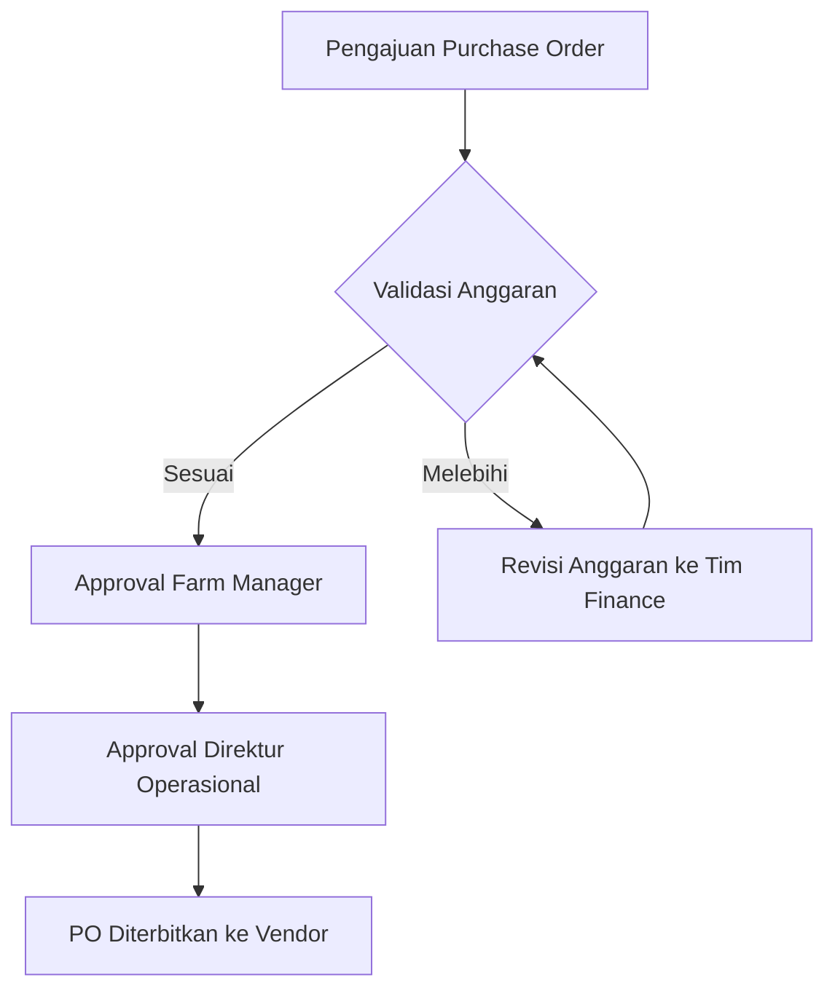
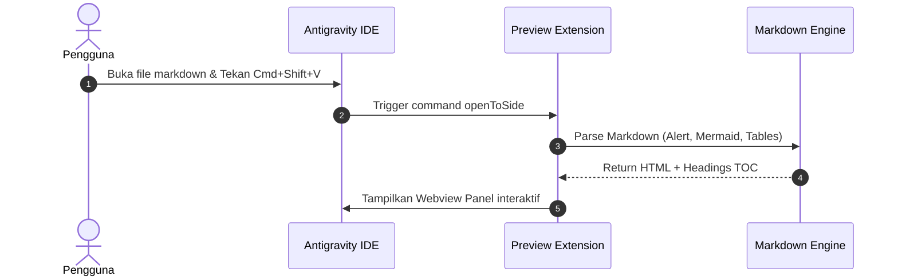
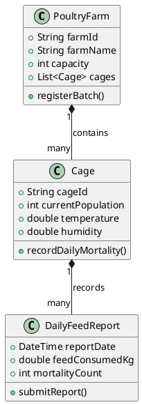

# Antigravity Markdown Preview Showcase

Selamat datang di **Antigravity Markdown Preview**! Dokumen ini mendemonstrasikan seluruh fitur visual modern yang didukung oleh ekstensi.

[TOC]

---

## 1. GitHub-Style Alerts

Ekstensi ini mendukung format alert resmi dengan aksen warna modern dan icon SVG:

> [!NOTE]
> Ini adalah **Note Alert**. Cocok untuk menyajikan informasi latar belakang atau catatan penting bagi pembaca.

> [!TIP]
> Ini adalah **Tip Alert**. Berisi saran, tips efisiensi, atau shortcut praktis untuk mempercepat alur kerja.

> [!IMPORTANT]
> Ini adalah **Important Alert**. Informasi krusial yang wajib diperhatikan sebelum melanjutkan ke langkah berikutnya.

> [!WARNING]
> Ini adalah **Warning Alert**. Peringatan untuk menghindari potensi error, breaking changes, atau kendala sistem.

> [!CAUTION]
> Ini adalah **Caution Alert**. Tindakan berisiko tinggi seperti penghapusan data permanen atau modifikasi konfigurasi sensitif.

---

## 2. Code Blocks & Syntax Highlighting

Mendukung penomoran baris, macOS window dots, badge bahasa, dan tombol sekali klik **Copy**:

```typescript
import * as vscode from 'vscode';

export function activate(context: vscode.ExtensionContext) {
  console.log('Antigravity Markdown Preview is now active!');
  
  const disposable = vscode.commands.registerCommand('antigravity.preview', () => {
    vscode.window.showInformationMessage('Opening Rich Preview...');
  });

  context.subscriptions.push(disposable);
}
```

```python
# Script Python dengan auto syntax highlighting
def calculate_growth_rate(initial_population: int, final_population: int, days: int) -> float:
    """Menghitung laju pertumbuhan populasi peternakan per hari."""
    if days <= 0:
        raise ValueError("Durasi hari harus lebih besar dari 0")
    return ((final_population - initial_population) / initial_population) / days

if __name__ == "__main__":
    rate = calculate_growth_rate(10000, 14500, 30)
    print(f"Laju pertumbuhan harian: {rate * 100:.2f}%")
```

---

## 3. Collapsible Sections

Mendukung format HTML `<details>` standar maupun sintaks blok `::: details`:

<details open>
  <summary>Klik untuk menutup/membuka: Panduan Instalasi Cepat</summary>
  
  1. Jalankan `npm run install-extension` di folder repo.
  2. Reload window Antigravity IDE (`Cmd+Shift+P` -> *Developer: Reload Window*).
  3. Buka file `.md` apa saja lalu tekan `Cmd+Shift+V`!
</details>

::: details Informasi Tambahan Konfigurasi Ekstensi
Anda dapat menyesuaikan server PlantUML di settings:
- `antigravity.markdownPreview.scrollSync`: `true` / `false`
- `antigravity.markdownPreview.plantumlServer`: `https://kroki.io`
- `antigravity.markdownPreview.codeLineNumbers`: `true` / `false`
:::

---

## 4. Mermaid Diagrams

Diagram Mermaid dirender secara interaktif langsung di sisi client (offline-ready):

### Flowchart Proses Persetujuan


### Sequence Diagram Komunikasi Layanan


---

## 5. PlantUML Diagrams

Mendukung diagram PlantUML yang di-render secara instan melalui SVG encoder:



---

## 6. Embedded Views

Dukungan responsive embed untuk video, audio, dan web view:

### YouTube Embed


---

## 7. Tables (GFM)

Tabel dengan styling modern, zebra stripe baris genap, scroll horizontal responsif, dan tombol copy TSV:

| ID Kandang | Kapasitas | Populasi Saat Ini | Suhu (°C) | Kelembaban | Status |
| :--------- | :-------- | :---------------- | :-------- | :--------- | :----- |
| KND-01-A   | 15,000    | 14,850            | 28.5      | 62%        | Normal |
| KND-01-B   | 15,000    | 14,920            | 29.1      | 65%        | Normal |
| KND-02-A   | 20,000    | 19,400            | 31.8      | 78%        | Alert  |
| KND-02-B   | 20,000    | 19,800            | 28.2      | 60%        | Normal |
| KND-03-A   | 12,000    | 11,950            | 27.9      | 58%        | Normal |

---

## 8. Navigasi & Table of Contents

- Daftar isi inline di atas dihasilkan otomatis dari tag `[TOC]`.
- Di sebelah kiri layar terdapat **Drawer TOC** interaktif yang otomatis melacak heading aktif saat Anda melakukan scrolling!
